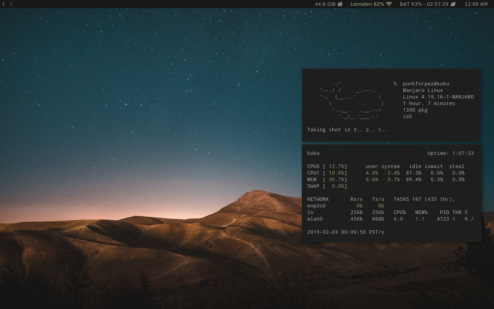

# Dotfiles for Manjaro

## Included in this repo:
I try to keep this as distro-agnostic as possible but there will be some changes needed.
Especially when switching out of major distro types (rpm, apt, etc).

* ~/bin and ~/scripts
* zsh
* irssi
* tmux
* kitty (with nord colorscheme)
* i3 / i3status
* vim

## To-Do
- [ ] Cleanup of .zshrc
- [ ] Dmenu and rofi theming
- [ ] Cleanup of ~/bin scripts
- [x] i3 revamp
- [x] kitty.conf
- [x] kitty color scheme (nord)
