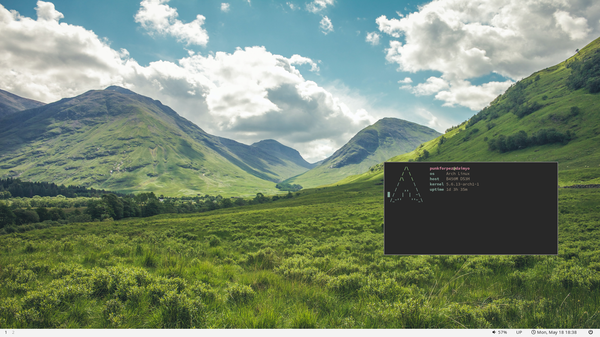

# Arch Linux Dotfiles

## Included in this repo:
Mainly my entire configuration for Arch Linux.

In the past this has been a dedicated Manjaro repo but I decided to switch everything back to Arch Linux. Although this will mean that the files here will still be as distro-agnostic as possible, just leaning more heavily towards Arch and it's derivatives. An example would be found in the Arch heavy aliases used in .zshrc.

## A Note on Gruvbox
I recently made the switch to a bastardized version of the Gruvbox theme. A few things have been added out of context into my overall desktop, including the differing colors in i3status. These are true to the Gruvbox palette, just not in the fashion they were intended.

## Switching to BSPWM
I receently made the switch to the excellent bspwm across all of my computers. I will update this repo as I progress through my setup and changes.

## Summary of Files
* ~/bin
* zshrc
* irssi configuration
* tmux config
* Termite terminal (w/ gruvbox theme)
* i3 / i3status (gruvbox)
* vim (gruvbox)
* Xresources (gruvbox)

## To-Do
- [x] Fully switch to gruvbox
- [x] Cleanup of .zshrc
- [x] Dmenu and rofi theming
- [x] Cleanup of ~/bin scripts
- [x] i3 revamp
- [x] kitty.conf
- [x] kitty color scheme (nord)
