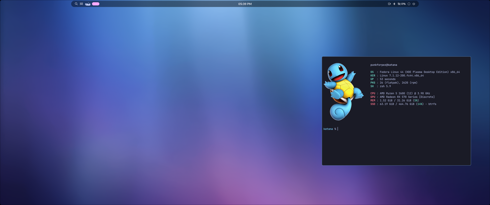
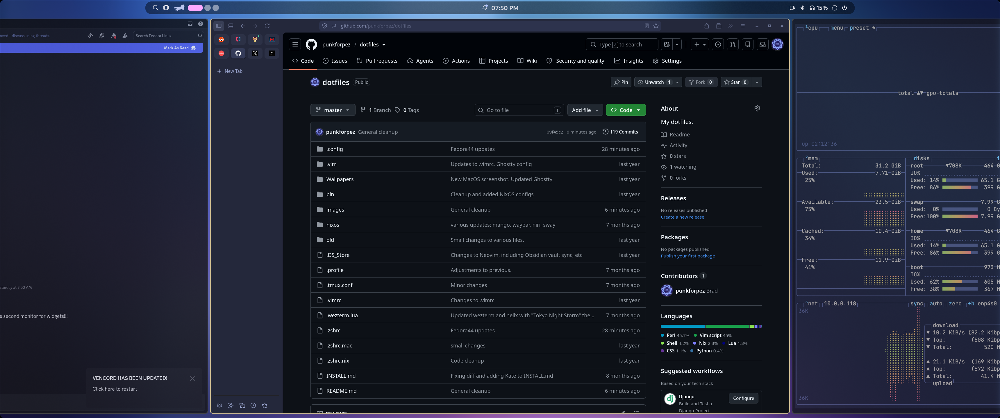
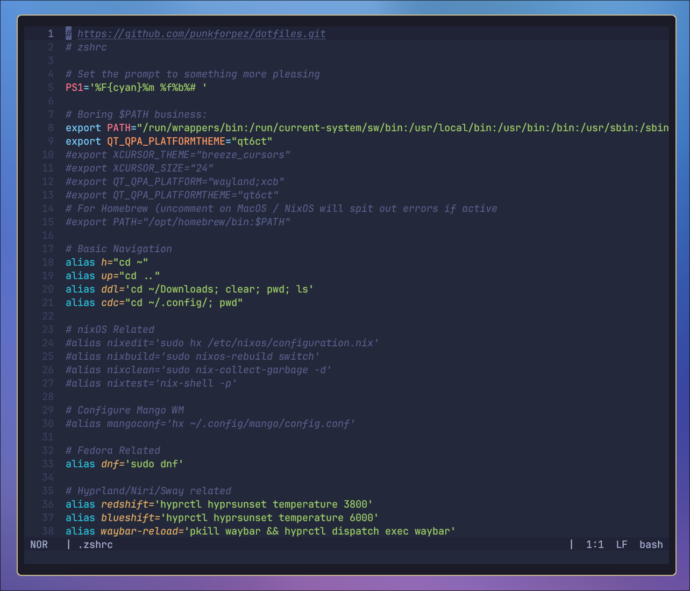

# Dotfiles

> These dotfiles are meant to be somewhat fluid between Linux and MacOS. Some items will need to be uncommented to hit parity.

## Fedora 44
> I have recently made the switch back to Fedora for my main Linux install. It's been a while since I've been properly on Fedora and it's like coming home fro ma long journey.

I use both KDE Plasma and MangoWM for my desktop setup, primarily operating with mango, since it's just incredible.

### Mango, main desktop with a scratchpad kitty terminal displaying fastfetch

### First desktop (currently set to "scrolling" (ala niri)) mode.

## The Setup

### Desktop Essentials
- [mangowm](https://github.com/mangowm/mango): The true "GOAT" of Wayland compositors, for me. This is the perfect comnbination of all the usual suspects; Hyprland, Niri, Sway. Truly an amazing experience and easy to configure.
- [Noctalia shell](https://github.com/noctalia-dev/noctalia): This shell truly changed the entire game of Wayland compositors for me. Waybar is a nice fall back, but man this thing is wonderful. 
- [Kitty](https://github.com/kovidgoyal/kitty): I just always go back to Kitty. Masterpiece.

### Main Software
- Firefox
- Steam
- Kate: God I love this program.
- Obsidian
- Spotify
- qbittorrent
- Telegram
- Vesktop
- Dolphin
- Joplin

### Terminal Software and Configuration
- zsh: There is no other.
- helix
- tmux
- yazi
- btop
- git

## MacOS
I use MacOS primarily for my day job but also like to keep a development setup on hand.

## Helix

> This amazing little editor has completely replaced nvim, Kate, Zed and VSCode for me. I am extremely happy with how Helix has wedged into my life.

- [Helix config](.config/helix/config.toml)

